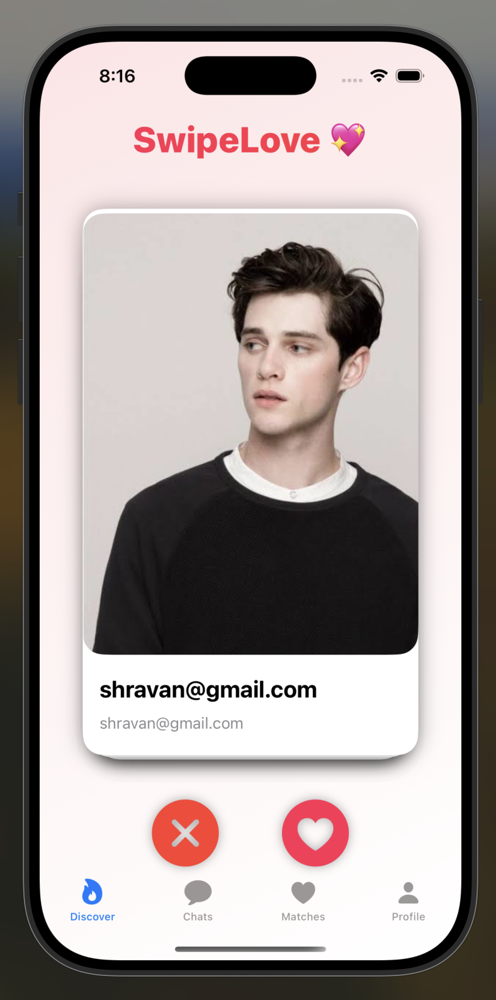
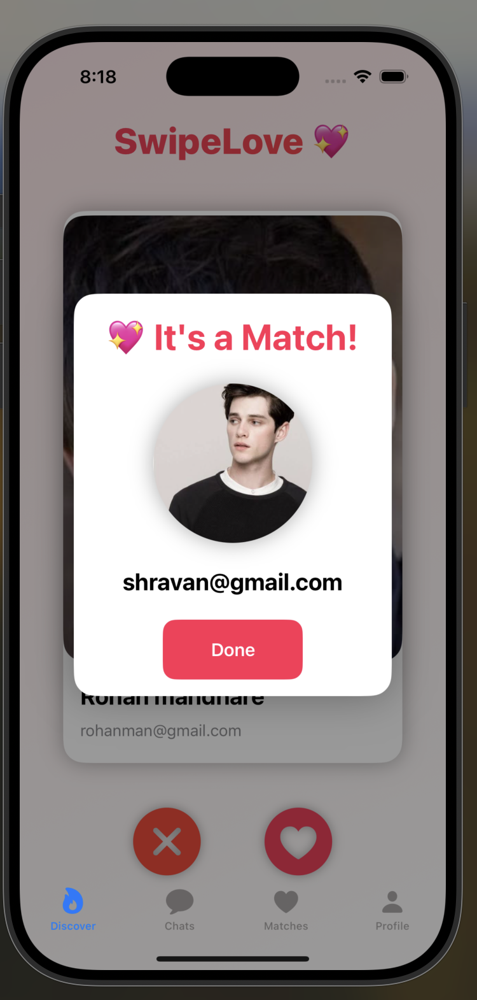
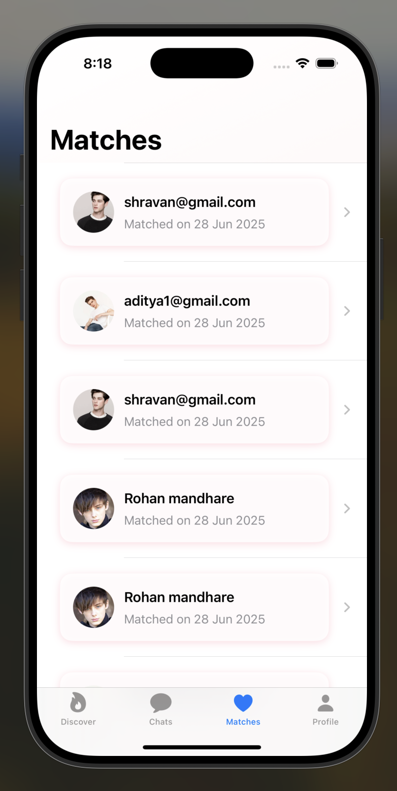
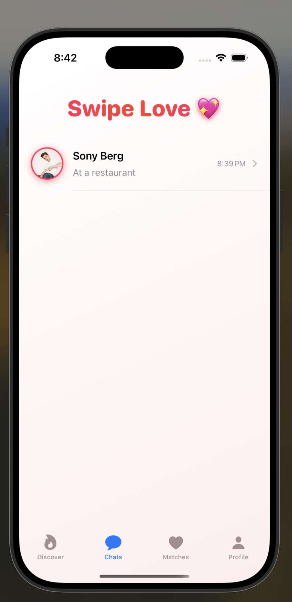
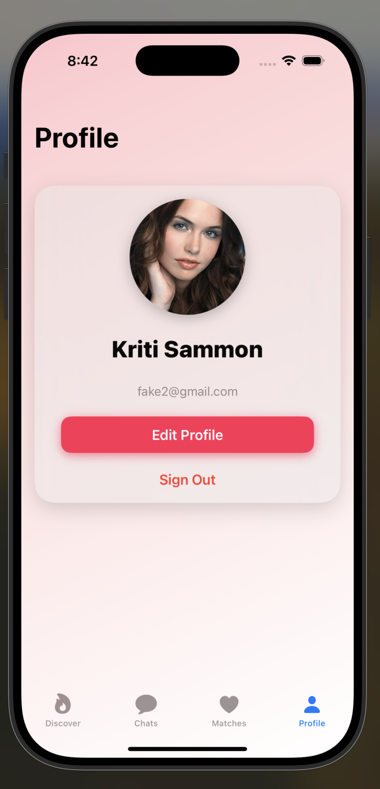
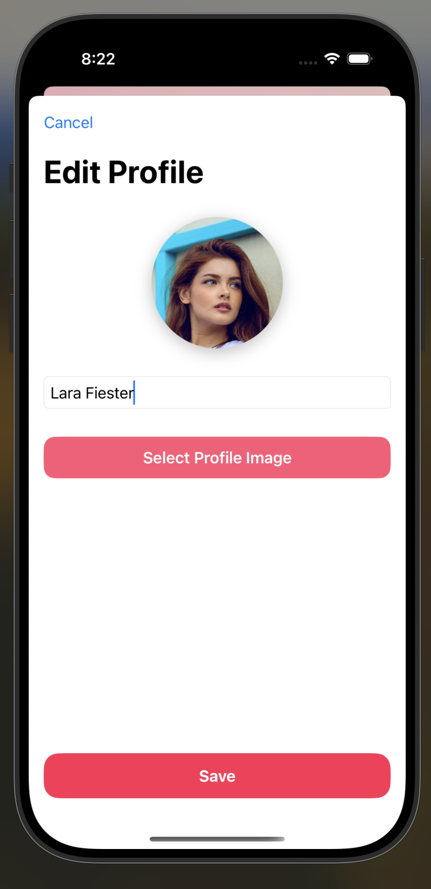
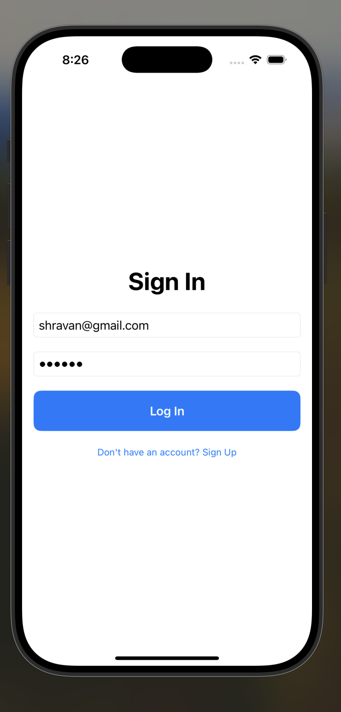
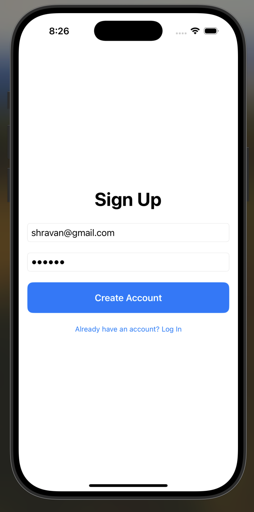

# 💖 SwipeLove – A Modern Dating App in SwiftUI

SwipeLove is a beautifully crafted iOS dating app built using **SwiftUI**, **Firebase**, and **Firestore**. Inspired by Tinder, it offers swipe-based matching, real-time chat, and personalized profiles — all with an elegant UI optimized for iPhones.

---

## ✨ Features

- 🔥 Swipe left or right to like or pass
- 💘 Match popup with animation when two users like each other
- 💬 Chat with matched users in real-time (Firestore)
- 👤 Edit your profile (name + profile picture)
- 🖼 Profile image stored in Firebase (base64 for free tier)
- 🌐 Live match list with timestamp
- 🪄 Polished animations and gradient UI
- ✅ Firebase Auth Integration

---

## 📸 Screenshots

# Cards View

         

> Add your screen images in a `Screenshots` folder inside the repo and link them above.

---

## 🛠 Setup Instructions

1. **Clone the repo**
   ```bash
   git clone https://github.com/aditya47050/SwipeLove.git
   cd SwipeLove

## 📦 Tech Stack
SwiftUI – Declarative UI framework

Firebase Auth – For login/signup

Firestore – Real-time data & matches

PhotosPicker – For selecting profile image

MVVM Pattern – Clean separation of concerns

GitHub – Version control

## 👨‍💻 Developed By
Aditya Kiran Mandhare

📧 adityamandhare47050@gmail.com

🔗 LinkedIn - https://www.linkedin.com/in/aditya-mandhare-00217a26b

💻 GitHub - https://github.com/aditya47050/
